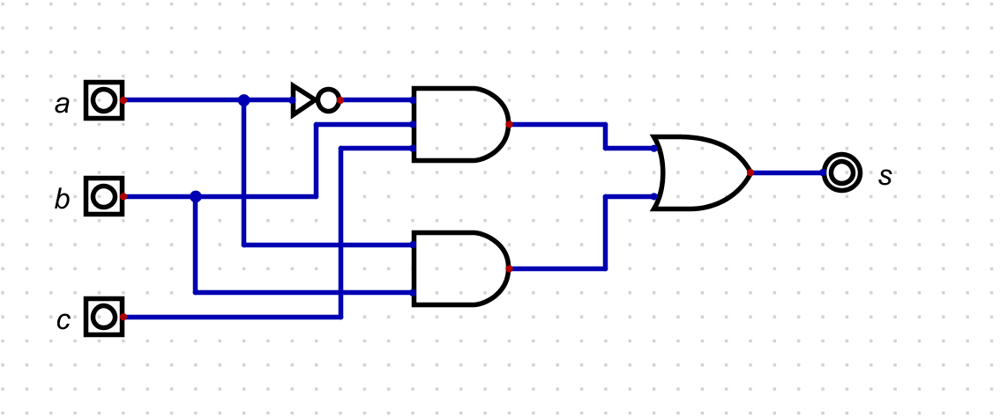
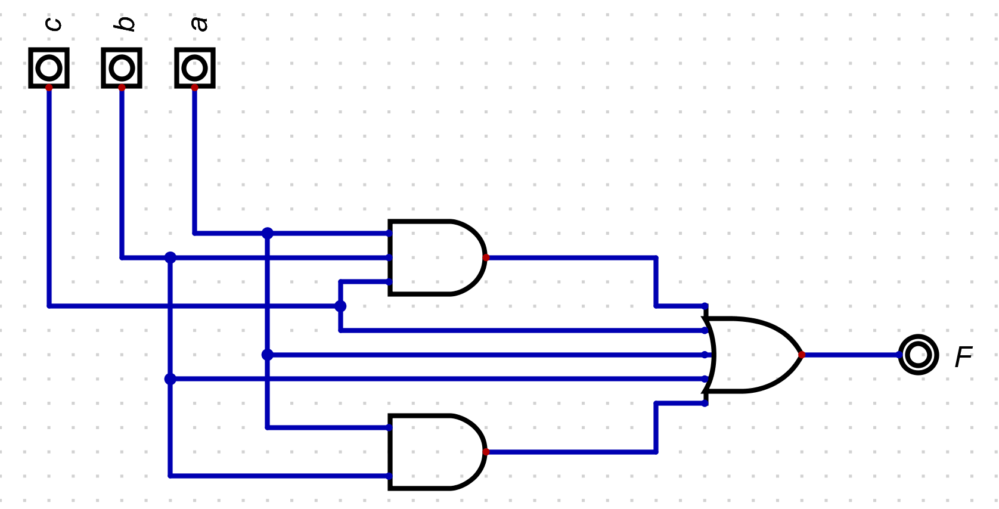

# Questão 2.30

Converta a seguinte equação booleana para um **circuito digital**:

\[
F(a, b, c) = a'bc + ab
\]

Essa equação indica que a saída **F = 1 (verdadeira)** quando **pelo menos uma** das condições abaixo é satisfeita:

- \(a = 0\), \(b = 1\) e \(c = 1\)  
- \(a = 1\) e \(b = 1\)

Ou seja, a função representa uma operação **OU** entre dois termos **AND**.

---

##  Tabela Verdade

| a | b | c | a' | a'bc | ab | F |
|---|---|---|----|------|----|---|
| 0 | 0 | 0 | 1 | 0 | 0 | 0 |
| 0 | 0 | 1 | 1 | 0 | 0 | 0 |
| 0 | 1 | 0 | 1 | 0 | 0 | 0 |
| 0 | 1 | 1 | 1 | 1 | 0 | 1 |
| 1 | 0 | 0 | 0 | 0 | 0 | 0 |
| 1 | 0 | 1 | 0 | 0 | 0 | 0 |
| 1 | 1 | 0 | 0 | 0 | 1 | 1 |
| 1 | 1 | 1 | 0 | 0 | 1 | 1 |

---

##  Circuito da Expressão

---

## b) Função Booleana

\[
F(a, b, c) = a'b
\]

A saída **F = 1** apenas quando **a for falso** (\(a'\)) **e b for verdadeiro**.  
Observe que o valor de **c não influencia** o resultado da função.

---

###  Tabela Verdade

| a | b | c | a' | F |
|---|---|---|----|---|
| 0 | 0 | 0 | 1 | 0 |
| 0 | 0 | 1 | 1 | 0 |
| 0 | 1 | 0 | 1 | 1 |
| 0 | 1 | 1 | 1 | 1 |
| 1 | 0 | 0 | 0 | 0 |
| 1 | 0 | 1 | 0 | 0 |
| 1 | 1 | 0 | 0 | 0 |
| 1 | 1 | 1 | 0 | 0 |

---

##  Circuito da Expressão

---

## c) Função Booleana

\[
F(a, b, c) = abc + ab + a + b + c
\]

A saída **F = 1** se **qualquer um** dos termos \(abc\), \(ab\), \(a\), \(b\) ou \(c\) for igual a 1.  
Essa função pode ser **simplificada** utilizando as leis da Álgebra Booleana:

\[
F = a + b + c
\]

---

###  Tabela Verdade

| a | b | c | F |
|---|---|---|---|
| 0 | 0 | 0 | 0 |
| 0 | 0 | 1 | 1 |
| 0 | 1 | 0 | 1 |
| 0 | 1 | 1 | 1 |
| 1 | 0 | 0 | 1 |
| 1 | 0 | 1 | 1 |
| 1 | 1 | 0 | 1 |
| 1 | 1 | 1 | 1 |

---

##  Circuito da Expressão

---

