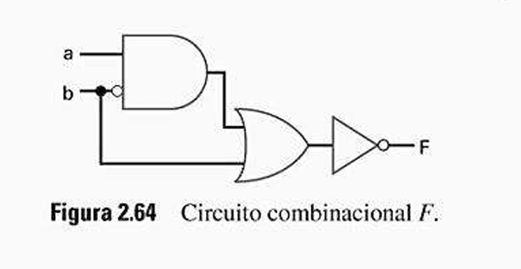

# Questão 2.31

Crie uma representação com equação booleana para o circuito digital da Fig. 2.64.

A melhor maneira de analisar um circuito digital é seguir o fluxo do sinal, da esquerda (entradas) para a direita (saída), identificando a função de cada porta lógica.

A primeira porta do circuito é uma porta **E (AND)**.

---

## Análise do Circuito

### Primeira Porta Lógica – AND

**Entradas:**  
Ela recebe o sinal **a** e o sinal **b** invertido (por causa do círculo), que representamos como **b'**.

**Função:**  
A porta realiza a operação **a E b'**.

**Equação da Saída (intermediária):**  
A saída desta porta é **ab'**.

---

### Segunda Porta Lógica – OR

A saída da porta anterior (**ab'**) se torna uma das entradas para a porta **OU (OR)**.

**Entradas:**  
As entradas desta porta são **ab'** e o sinal original **b**.

**Função:**  
A porta realiza a operação **(ab') OU (b)**.  
A operação OU é representada pelo sinal de mais **+**.

**Equação da Saída (intermediária):**  
A saída desta porta é **(ab') + b**.

---

### Terceira Porta Lógica – NOT (Inversor)

A saída da porta OU (**ab' + b**) entra na última porta, que é um **inversor (NÃO / NOT)**.

**Entrada:**  
A entrada do inversor é **(ab') + b**.

**Função:**  
O inversor nega toda a sua entrada.  
A negação é representada por uma apóstrofe **'** no final da expressão.

---

## Equação da Saída Final

**Equação da Saída Final (F):**  
A saída final **F** é a negação de tudo o que veio antes.

Concluindo, a equação booleana para o circuito é:

\[
F = (ab' + b)'
\]

