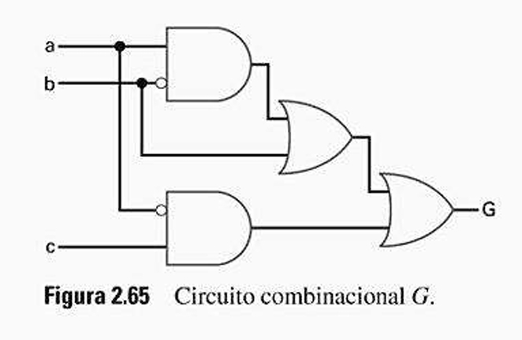

# Questão 2.32

Crie uma representação com equação booleana para o circuito digital da Fig. 2.65.

---

## Analisando o circuito:

### Porta E (AND) de Cima:
Recebe a entrada **a** diretamente.  
Recebe a entrada **b**, mas com um círculo de inversão. Portanto, a entrada é **b'**.  
A saída desta porta é **ab'**.

### Porta OU (OR) do Meio:
Recebe a saída da porta anterior (**ab'**).  
Recebe a entrada **b** diretamente.  
A saída desta porta é a soma das duas: **(ab' + b)**.

### Porta E (AND) de Baixo:
Recebe a entrada **a**, mas com um círculo de inversão. Portanto, a entrada é **a'**.  
Recebe a entrada **c** diretamente.  
A saída desta porta é **a'c**.

### Porta OU (OR) Final:
Recebe a saída da porta OU do meio (**ab' + b**).  
Recebe a saída da porta E de baixo (**a'c**).  

Ela soma tudo, resultando na equação final para **G**:

G = (ab' + b) + a'c

Apesar de parecer complexo, tem a mesma função lógica que uma simples porta **OU** de três entradas recebendo **a**, **b** e **c**.  
Ele produzirá uma saída **1** se qualquer uma de suas entradas for **1**.

