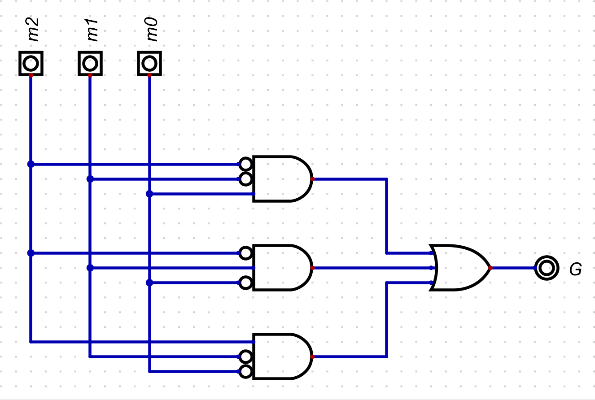

## Questão 2.54

Crie um circuito para o museu do Exercício 2.53 que detecta se o guarda está fazendo a ronda no museu de maneira apropriada. Isso pode ser detectado quando há exatamente um sensor de movimento em 1. (se nenhum sensor estiver em 1, o guarda deve estar sentado ou dormindo.)

---

### Variáveis de entrada

As mesmas 3 dos sensores de movimento.  
**m2, m1, m0** (1 = movimento, 0 = sem movimento).

---

### Variáveis de Saída

Uma nova saída que vamos chamar de **G** (para Guarda OK).

- **G = 1**: A ronda está sendo feita corretamente.  
- **G = 0**: A ronda NÃO está sendo feita (ou há um problema).

A saída **G** deve ser **1** *quando há exatamente um sensor de movimento em 1*.  
Em todos os outros casos (nenhum sensor ou mais de um sensor ativo), a saída será **0**.

---

### Tabela Verdade do Circuito

| m2 | m1 | m0 | sensores ativos | G - saída Guarda |
|----|----|----|-----------------|------------------|
| 0  | 0  | 0  | 0               | 0                |
| 0  | 0  | 1  | 1               | 1                |
| 0  | 1  | 0  | 1               | 1                |
| 0  | 1  | 1  | 2               | 0                |
| 1  | 0  | 0  | 1               | 1                |
| 1  | 0  | 1  | 2               | 0                |
| 1  | 1  | 0  | 2               | 0                |
| 1  | 1  | 1  | 3               | 0                |

---

### Obtendo a Expressão Booleana

Usando o método da **"Soma de Produtos"**, pegamos todas as linhas onde a saída **G** é **1**.

- Linha 2: m2=0, m1=0, m0=1 → Termo: `m2'm1'm0`  
- Linha 3: m2=0, m1=1, m0=0 → Termo: `m2'm1m0'`  
- Linha 5: m2=1, m1=0, m0=0 → Termo: `m2m1'm0'`  

Somando (operação OU) os termos, obtemos a expressão booleana para **G**:
    G = m2'm1'm0 + m2'm1m0' + m2m1'm0'

---

### Simplificando a Expressão

Analisando a expressão para ver se é possível simplificá-la.
    G = m2'm1'm0 + m2'm1m0' + m2m1'm0'

Neste caso, não há termos adjacentes que possam ser agrupados usando as regras padrão da Álgebra Booleana (como A + A'B = A+B). Cada termo representa uma condição única e exclusiva (apenas m0 ativo, apenas m1 ativo, apenas m2 ativo).

Portanto, a expressão já está em sua forma mais simples (na forma de soma de produtos).

---

### Circuito Lógico

