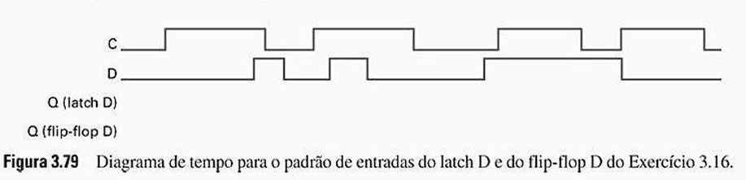
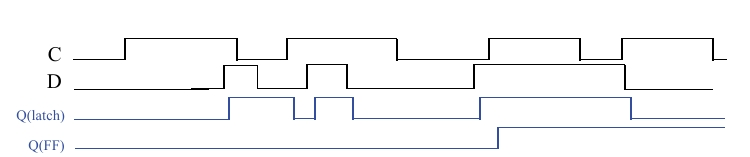

## Questão 3.16

Compare os comportamentos de um latch D e um flip-flop D completando o diagrama de tempo Fig. 3.79. Assuma que cada dispositivo armazena inicialmente um 0. Dê uma breve explicação do comportamento de cada dispositivo.

---

## Princípios Fundamentais (As Mesmas "Regras do Jogo")

As regras que governam os dispositivos são as mesmas da questão anterior e são a chave para entender o diagrama:

### Latch D (Sensível ao Nível)

- Quando **C = 1** (nível alto): A saída **Q** é uma cópia exata e contínua da entrada **D** (comportamento "transparente").  
- Quando **C = 0** (nível baixo): A saída **Q** "trava" e mantém seu último valor, ignorando qualquer mudança em **D**.

### Flip-Flop D (Sensível à Borda)

- A saída **Q** só pode mudar no instante preciso da **borda de subida de C** (a transição de 0 para 1).  
- Nesse momento, ele "fotografa" **D**.  
- Fora desse instante, **Q** mantém seu valor armazenado.

---

## Diagrama Completo

---

## Análise Passo a Passo do Diagrama de Tempo

Seguindo a linha do tempo da esquerda para a direita, analisando o que acontece em cada pulso do clock **C**.

---

### Primeiro Pulso de Clock

**Na 1ª borda de subida de C:**

- **Latch:** C sobe para 1, tornando-se transparente. Nesse momento, D está em 1, então Q(latch) sobe para 1.  
- **Flip-Flop:** Detecta a borda de subida e amostra D. Como D está em 1, Q(FF) sobe para 1.

**Na 1ª borda de descida de C:**

- **Latch:** C desce para 0. O latch trava. No instante da descida, D está em 1, então Q(latch) trava em 1.  
- **Flip-Flop:** Não há mudança.

---

### Segundo Pulso de Clock (O Ponto Mais Importante!)

**Na 2ª borda de subida de C:**

- **Latch:** C sobe para 1 (transparente). D está em 0, então Q(latch) desce de 1 para 0.  
- **Flip-Flop:** Vê a borda de subida e amostra D. D está em 0, então Q(FF) desce de 1 para 0.

**Enquanto C está em 1:**

- **Latch:** A entrada D faz um pulso rápido (sobe para 1 e desce para 0). Como o latch é transparente, sua saída Q(latch) espelha fielmente este pulso.  
- **Flip-Flop:** Ignora completamente o pulso em D porque não está em uma borda de subida. Q(FF) permanece estável em 0.

**Na 2ª borda de descida de C:**

- **Latch:** C desce para 0 e trava. No momento da descida, D estava em 0, então Q(latch) trava em 0.  
- **Flip-Flop:** Não há mudança.

---

### Terceiro e Quarto Pulsos de Clock

**Na 3ª e 4ª bordas de subida de C:**

- **Latch:** C sobe, D está em 1. Q(latch) sobe para 1 e permanece lá enquanto C for alto, pois D não muda.  
- **Flip-Flop:** Vê a borda de subida, amostra D que está em 1. Q(FF) sobe para 1 e permanece lá até a próxima borda de subida.

As bordas de descida travam o latch no valor 1, e não afetam o flip-flop.

---

Enquanto a entrada **C (clock)** for 1, o **latch D** irá armazenar o valor de **D** (após um pequeno atraso de porta).  
O **flip-flop D** só irá armazenar o valor de **D** na borda de subida de **C** (após um pequeno atraso de porta).

O segundo pulso de clock é o melhor exemplo: o latch é suscetível a "ruídos" ou mudanças rápidas em **D** enquanto está habilitado, enquanto o flip-flop ignora essas mudanças, provendo uma saída muito mais estável e sincronizada, que só muda uma vez por ciclo de clock.

