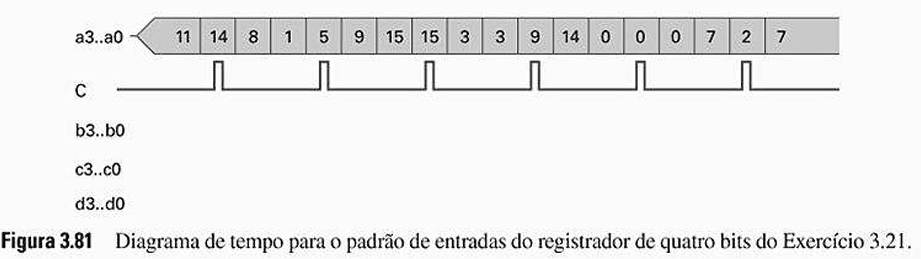
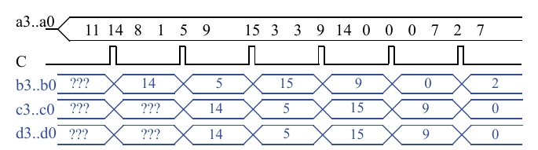

# Questão 3.21

Considere três registradores de quatro bits que estão conectados entre si como mostrado na Fig. 3.80. Assuma que os valores iniciais dos registradores são desconhecidos. Analise o comportamento dos registradores completando o diagrama de tempo da Fig. 3.81.

---

## Princípio de Funcionamento do Circuito

Como os registradores estão conectados na Fig. 3.81.

- A entrada de dados **a (a3..a0)** alimenta o primeiro registrador (vamos chamá-lo de **B**), cuja saída é **b (b3..b0)**.
- A saída **b** do primeiro registrador alimenta a entrada do segundo registrador (**C**), cuja saída é **c (c3..c0)**.
- A saída **c** do segundo registrador alimenta a entrada do terceiro registrador (**D**), cuja saída é **d (d3..d0)**.

A estrutura é uma cascata:
    a → [Registrador B] → b → [Registrador C] → c → [Registrador D] → d

---

## A regra de funcionamento é:

- **Operação Síncrona:** Todos os três registradores compartilham o mesmo sinal de clock **C**.
- **Na borda de subida de C:** Cada registrador, simultaneamente, "fotografa" (amostra) o valor que está em sua entrada e o copia para sua saída. Isso cria um atraso de um ciclo de clock a cada estágio.
- **Condição Inicial:** As saídas **b**, **c** e **d** começam com valores desconhecidos (???).

---

## Diagrama Completo

---

## Análise Passo a Passo do Diagrama de Tempo

Percorrendo o tempo, analisando o que acontece em cada borda de subida do clock **C**.

---

### Na 1ª Borda de Subida de C:

**Entradas no momento da borda:**

- Entrada do Registrador B = a = 14  
- Entrada do Registrador C = b = ???  
- Entrada do Registrador D = c = ???  

**Saídas após a borda:**

- b é atualizado com o valor de a → b se torna 14.  
- c é atualizado com o valor de b → c continua ???.  
- d é atualizado com o valor de c → d continua ???.  

---

### Na 2ª Borda de Subida de C:

**Entradas no momento da borda:**

- Entrada do Registrador B = a = 5  
- Entrada do Registrador C = b = 14  
- Entrada do Registrador D = c = ???  

**Saídas após a borda:**

- b é atualizado com o valor de a → b se torna 5.  
- c é atualizado com o valor de b → c se torna 14.  
- d é atualizado com o valor de c → d continua ???.  

---

### Na 3ª Borda de Subida de C:

**Entradas no momento da borda:**

- Entrada do Registrador B = a = 15  
- Entrada do Registrador C = b = 5  
- Entrada do Registrador D = c = 14  

**Saídas após a borda:**

- b se torna 15.  
- c se torna 5.  
- d se torna 14.  

---

### Na 4ª Borda de Subida de C:

**Entradas no momento da borda:**

- Entrada do Registrador B = a = 9  
- Entrada do Registrador C = b = 15  
- Entrada do Registrador D = c = 5  

**Saídas após a borda:**

- b se torna 9.  
- c se torna 15.  
- d se torna 5.  

---

### Na 5ª, 6ª e 7ª Bordas de Subida:

O mesmo padrão continua. A cada pulso do clock, os dados "deslocam" uma posição para a direita no diagrama:

- Na 5ª borda: b recebe a = 0, c recebe o antigo b = 9, d recebe o antigo c = 15.  
- Na 6ª borda: b recebe a = 0, c recebe o antigo b = 0, d recebe o antigo c = 9.  
- Na 7ª borda: b recebe a = 2, c recebe o antigo b = 0, d recebe o antigo c = 0.  

---

## Resumo do Comportamento

Este circuito funciona como uma linha de montagem ou esteira rolante para dados de 4 bits. A cada pulso do clock, os dados avançam um estágio. O valor que está em **a** passa para **b**; o valor que estava em **b** passa para **c**; e o que estava em **c** passa para **d**.

É por isso que vemos o valor **14**, por exemplo, aparecer na saída **b** após o 1º pulso, na saída **c** após o 2º pulso, e na saída **d** após o 3º pulso.
