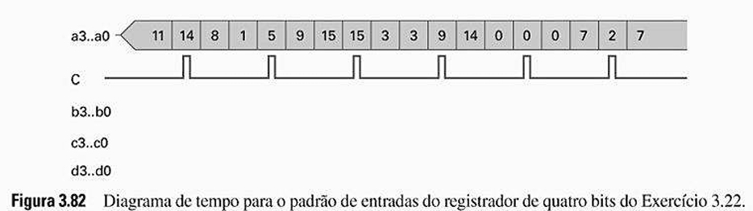
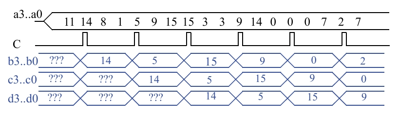

# Questão 3.22

Considere três registradores de quatro bits que estão conectados entre si como mostrado na Fig. 3.83. Assuma que os valores iniciais dos registradores são desconhecidos. Analise o comportamento dos registradores complementando o diagrama de tempo da Fig. 3.82.

---

## Passo 1: Entendendo o Funcionamento do Circuito (Fig. 3.83)

Primeiro, analisa-se a Fig. 3.83 para entender como os componentes estão conectados.

### Estrutura em Cascata (Pipeline)

A imagem mostra três registradores de 4 bits (reg(4)) conectados em série.

- A entrada de dados externa (a3..a0) é conectada à entrada I do primeiro registrador.
- A saída Q do primeiro registrador (b3..b0) é conectada à entrada I do segundo registrador.
- A saída Q do segundo registrador (c3..c0) é conectada à entrada I do terceiro registrador.
- A saída final do sistema é a saída Q do terceiro registrador (d3..d0).

### Operação Síncrona

É crucial observar que o mesmo sinal de clock C está conectado à entrada de clock de todos os três registradores. Isso significa que eles atualizam seus valores exatamente no mesmo instante: na borda de subida do clock.

### Comportamento Resultante

O circuito funciona como uma "esteira rolante" de dados. A cada pulso do clock, o dado avança um estágio: o valor de a passa para b, o valor que estava em b passa para c, e o valor que estava em c passa para d.

---

## Passo 2: Preenchendo o Diagrama de Tempo (Fig. 3.82) Passo a Passo

Agora, usando essa lógica para preencher o diagrama de tempo em branco da Fig. 3.82.

### Condição Inicial

Os valores de b, c e d são desconhecidos (???).

---

### Na 1ª Borda de Subida de C:

- O Registrador B lê sua entrada, a, que no momento da borda vale 14.
- O Registrador C lê sua entrada, b, que vale ???.
- O Registrador D lê sua entrada, c, que vale ???.

Após a borda: b se torna 14. c continua ???. d continua ???.

---

### Na 2ª Borda de Subida de C:

- O Registrador B lê a = 5.
- O Registrador C lê b = 14.
- O Registrador D lê c = ???.

Após a borda: b se torna 5. c se tornar 14. d continua ???.

---

### Na 3ª Borda de Subida de C:

- O Registrador B lê a = 15.
- O Registrador C lê b = 5.
- O Registrador D lê c = 14.

Após a borda: b se torna 15. c se torna 5. d se torna 14.

---

### Na 4ª Borda de Subida de C:

- O Registrador B lê a = 9.
- O Registrador C lê b = 15.
- O Registrador D lê c = 5.

Após a borda: b se torna 9. c se torna 15. d se torna 5.

---

## Continuamos este processo para os pulsos restantes:

- Na 5ª borda: a = 14, b = 9, c = 15 → b se torna 14, c se torna 9, d se torna 15.
- Na 6ª borda: a = 0, b = 14, c = 9 → b se torna 0, c se torna 14, d se torna 9.
- Na 7ª borda: a = 7, b = 0, c = 14 → b se torna 7, c se torna 0, d se torna 14.

---

## O Diagrama de Tempo Completo e o Resumo do Comportamento

Seguindo a lógica acima, o diagrama de tempo da Fig. 3.82, agora completo, fica assim:

---

## Resumo do Comportamento:

O circuito implementa um registrador de deslocamento de 3 estágios. A cada pulso do clock, os dados na entrada a são "empurrados" para o primeiro registrador, e os dados de cada registrador são empurrados para o próximo na fila.

É por isso que um valor que aparece na entrada a em um determinado ciclo de clock só aparecerá na saída b no ciclo seguinte, na saída c dois ciclos depois, e na saída final d três ciclos depois. Por exemplo, o valor 15 que está em a no 3º ciclo, aparece em b no 4º, em c no 5º, e em d no 6º ciclo.
