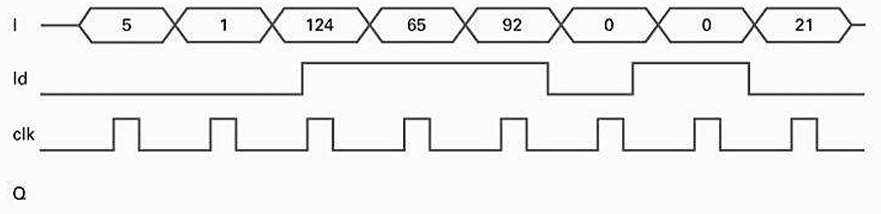
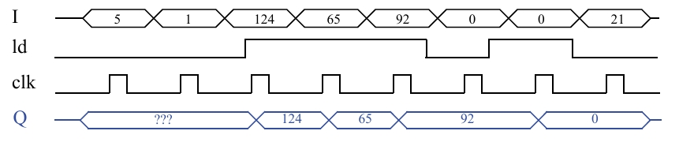

# Seção 4.2: Registradores

## Questão 4.1

Analise o comportamento de um registrador de oito bits de carga paralela com entrada I, saída Q e entrada de controle de carga ld, completando o seguinte diagrama de tempo.

---

## Princípios Fundamentais (As Regras do Jogo)

Como você bem descreveu, o comportamento do registrador é governado pelo sinal de controle ld no momento da borda de subida do clock:

- Quando ld = 1 (Modo de Carga): Na borda de subida do clock, a saída Q é atualizada com o valor da entrada I.
- Quando ld = 0 (Modo de Manutenção): Na borda de subida do clock, a saída Q ignora a entrada I e mantém seu valor anterior.

---

## O Diagrama de Tempo Completo

---

## Análise Passo a Passo do Diagrama de Tempo

Analisar o que acontece em cada borda de subida do clock (clk), da esquerda para a direita.

### Condição Inicial

A saída Q começa com um valor desconhecido, representado por ???.

---

### Na 1ª Borda de Subida do Clock:

- Verificamos o sinal ld: está em 0 (nível baixo).
- Operação: Manutenção (Hold).
- Resultado: Q mantém seu valor anterior, que é ???.

---

### Na 2ª Borda de Subida do Clock:

- Verificamos o sinal ld: ainda está em 0.
- Operação: Manutenção (Hold).
- Resultado: Q novamente mantém seu valor anterior, que continua sendo ???. (Esta é a resposta para a seção "???" do diagrama).

---

### Na 3ª Borda de Subida do Clock:

- Verificamos o sinal ld: agora está em 1 (nível alto).
- Operação: Carga (Load).
- Ação: O registrador "fotografa" o valor da entrada I, que neste momento é 124.
- Resultado: Q muda de ??? para 124.

---

### Na 4ª Borda de Subida do Clock:

- Verificamos o sinal ld: continua em 1.
- Operação: Carga (Load).
- Ação: O registrador amostra a entrada I, que agora é 65.
- Resultado: Q muda de 124 para 65.

---

### Na 5ª Borda de Subida do Clock:

- Verificamos o sinal ld: continua em 1.
- Operação: Carga (Load).
- Ação: O registrador amostra a entrada I, que agora é 92.
- Resultado: Q muda de 65 para 92.

---

### Na 6ª Borda de Subida do Clock:

- Verificamos o sinal ld: desceu para 0.
- Operação: Manutenção (Hold).
- Ação: O registrador ignora a entrada I (que é 0) e mantém seu valor.
- Resultado: Q permanece em 92.

---

### Na 7ª Borda de Subida do Clock:

- Verificamos o sinal ld: subiu para 1.
- Operação: Carga (Load).
- Ação: O registrador amostra a entrada I, que é 0.
- Resultado: Q muda de 92 para 0.

---

### Na 8ª Borda de Subida do Clock:

- Verificamos o sinal ld: desceu para 0.
- Operação: Manutenção (Hold).
- Ação: O registrador ignora a entrada I (que é 21) e mantém seu valor.
- Resultado: Q permanece em 0 até o final do diagrama.

---

## Resumo do Comportamento

O diagrama de tempo, uma vez completo, ilustra perfeitamente a função de um registrador com carga controlada. Ele atua como uma memória que só é "gravável" quando o sinal ld permite. Fora desses momentos, ele protege e mantém o dado armazenado, independentemente do que acontece na sua entrada de dado
