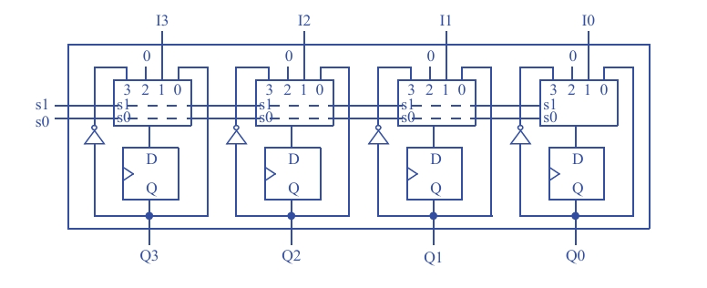

# Questão 4.3

Projete um registrador de quatro bits com duas entradas de controle s1 e s0, quatro entradas de dados I3, I2, I1 e I0, e quatro saídas de dados Q3, Q2, Q1 e Q0. Quando s1s2 = 00, o registrador mantém o seu valor. Quando s1s2 = 01, o registrador carrega I3.I0. Quando s1s0 = 10, o registrador é carregado com 0000. Quando s1s0 = 11, o registrador faz o complemento do conteúdo, de modo que, por exemplo, 0000 torna-se 1111 e 1010 torna-se 0101. (Problema de projeto de componente.)

---

## O Objetivo 

Primeiro, vamos relembrar as quatro operações que o registrador precisa executar, com base nos sinais de controle s1 e s0:

| s1 | s0 | Operação                 | Descrição do que deve acontecer com a saída Q |
|----|----|--------------------------|-----------------------------------------------|
| 0  | 0  | Manter (Hold)            | Q deve continuar com seu valor atual.          |
| 0  | 1  | Carga Paralela (Load)    | Q deve receber o valor da entrada I.           |
| 1  | 0  | Limpar (Clear)           | Q deve ser forçado a 0000.                     |
| 1  | 1  | Complemento              | Q deve receber o inverso do seu próprio valor (ex: 1010 vira 0101). |

---

## Registrador

---

## Etapa 1: A Estratégia de Projeto - "Bit-Slice" com Multiplexador

O circuito da imagem usa a abordagem mais eficiente para este problema:

- **Design Modular:** O registrador de 4 bits é construído a partir de 4 blocos idênticos, um para cada bit (Q3, Q2, Q1, Q0). Cada um desses blocos é chamado de "bit-slice".
- **Componentes de um Bit-Slice:** Cada fatia (slice) do circuito contém dois componentes principais:
  - Um Flip-Flop tipo D para armazenar o bit de dado.
  - Um Multiplexador (MUX) 4-para-1 para decidir qual valor será armazenado no flip-flop no próximo pulso de clock.
- **Controle Centralizado:** As entradas de controle s1 e s0 são conectadas às entradas de seleção de todos os quatro multiplexadores, garantindo que todos os 4 bits executem a mesma operação ao mesmo tempo.

---

## Etapa 2: A Lógica do Multiplexador (O "Cérebro" da Operação)

Esta é a parte mais importante. Vamos focar em apenas um dos "bit-slices" (por exemplo, o da esquerda, para Q3) e ver o que está conectado a cada uma das 4 entradas do MUX. A  
A lógica é a mesma para todos os outros.

---

### Função 00: Manter (Hold)

Quando s1s0 = 00, o MUX seleciona sua entrada 0.

- No diagrama: O fio da entrada 0 vem diretamente da saída Q do flip-flop.
- Explicação: Isso cria um loop que realimenta o valor atual do flip-flop de volta para sua própria entrada. No próximo pulso de clock, ele simplesmente recarrega o valor que já tinha, ou seja, mantém o estado.

---

### Função 01: Carga Paralela (Load)

Quando s1s0 = 01, o MUX seleciona sua entrada 1.

- No diagrama: O fio da entrada 1 está conectado ao pino de dados externo (I3).
- Explicação: Isso permite que um novo valor vindo de fora do registrador seja selecionado e preparado para ser armazenado, realizando a operação de carga.

---

### Função 10: Limpar (Clear)

Quando s1s0 = 10, o MUX seleciona sua entrada 2.

- No diagrama: A entrada 2 está conectada a um valor fixo de 0.
- Explicação: Isso força a entrada do flip-flop a ser 0, independentemente do seu estado atual ou da entrada I. No próximo pulso de clock, o flip-flop será zerado.

---

### Função 11: Complemento (Complement)

Quando s1s0 = 11, o MUX seleciona sua entrada 3.

- No diagrama: O fio da entrada 3 vem da saída Q do flip-flop, mas passa por um inversor (porta NÃO), representado pelo pequeno círculo.
- Explicação: Isso alimenta o flip-flop com o inverso (Q') de seu próprio valor. Se Q era 1, a entrada se torna 0, e vice-versa. No próximo pulso de clock, o registrador irá complementar seu conteúdo.

---

## Etapa 3: O Registrador Completo

O circuito final é simplesmente a replicação desta estrutura "bit-slice" quatro vezes, uma para cada bit. Todos os flip-flops compartilham o mesmo clock (não mostrado, mas implícito) e os MUXes compartilham as mesmas linhas de seleção s1 e s0, garantindo um funcionamento síncrono e coeso.
