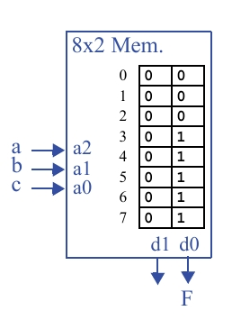

## SEÇÃO 7.3: TECNOLOGIA DE ICs PROGRAMÁVEIS – FPGA

### Questão 7.20
Mostre como implementar em uma tabela lookup, de três entradas e duas saídas, a função  
**F(a, b, c) = a + bc**.

---

Uma Tabela de Consulta (*Look-Up Table* ou **LUT**) é, em essência, uma pequena memória.  
Os sinais de entrada (a, b, c, etc.) formam um "endereço", e o valor armazenado nesse endereço é enviado para a saída.  
Uma LUT de 3 entradas tem \(2^3 = 8\) posições de memória.

**Objetivo:** Implementar a função **F = a + bc** em uma LUT de 3 entradas e 2 saídas.

---

### Tabela Verdade da Função

| a | b | c | bc | F |
|---|---|---|----|---|
| 0 | 0 | 0 | 0  | 0 |
| 0 | 0 | 1 | 0  | 0 |
| 0 | 1 | 0 | 0  | 0 |
| 0 | 1 | 1 | 1  | 1 |
| 1 | 0 | 0 | 0  | 1 |
| 1 | 0 | 1 | 0  | 1 |
| 1 | 1 | 0 | 0  | 1 |
| 1 | 1 | 1 | 1  | 1 |

---

### Programando o Conteúdo da LUT

A LUT de 3 entradas usará **a, b, c** como seu endereço (de `000` a `111`).  
O valor da coluna **F** da tabela-verdade é o que precisa ser armazenado na memória da LUT.

Como a LUT tem duas saídas (vamos chamá-las de **OUT1** e **OUT0**), e a função só precisa de uma, utiliza-se **OUT0** para a função **F** e simplesmente programa-se **OUT1** para ser sempre `0`.

---

### Conteúdo a ser armazenado na LUT

| Endereço (abc) | Valor de F | F = a + bc (Saída Esperada) |
|----------------|------------|-----------------------------|
| 000 | 0 | 00 |
| 001 | 0 | 00 |
| 010 | 0 | 00 |
| 011 | 1 | 01 |
| 100 | 1 | 01 |
| 101 | 1 | 01 |
| 110 | 1 | 01 |
| 111 | 1 | 01 |

---

## LUT

O circuito final é simplesmente a LUT com suas entradas e saídas conectadas.

**Observação:**  
A coluna **d1** está toda com `0` porque a nossa função **F** só precisa de uma saída.  
A segunda saída da LUT (**d1**) não é utilizada neste problema.

---

### Conclusão

O conteúdo da coluna **d0** da LUT na imagem é idêntico ao resultado da tabela-verdade da função  
**F = a + bc**.

**2 saídas de dados (d1, d0):**  
O conteúdo da posição de memória selecionada aparece nessas saídas.  
A saída final **F** está conectada a **d0**.

