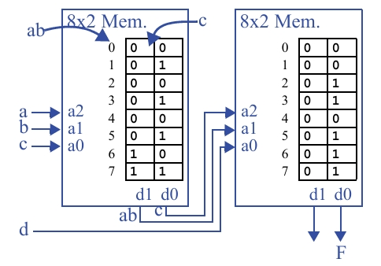

## Questão 7.21

Mostre como implementar em duas tabelas lookup, de três entradas e duas saídas, a função  
**F(a, b, c) = ab + cd**. Assuma que você pode conectar as tabelas lookup de forma customizada  
(isto é, não use uma matriz de chaveamento, simplesmente ligue diretamente os seus fios).

---

**Objetivo:** Implementar a função **F = ab + cd** usando duas LUTs de 3 entradas e 2 saídas.

**Observação:**  
A função **F = ab + cd** possui 4 variáveis (a, b, c, d). A questão pede para usar LUTs de 3 entradas, então precisamos decompor a função.

A estratégia é usar a primeira LUT para calcular uma parte do problema e alimentar o resultado dela na segunda LUT, que calculará o resultado final.

---

## Decompondo a Função

Dividindo a função **F = ab + cd** em duas partes.

- **LUT1:** Pode calcular a primeira parte, **ab**. Vamos chamar sua saída de **X**.  
  Então, **X = ab**.

- **LUT2:** Recebe o resultado **X** e as outras variáveis para calcular a função final.  
  A função se torna **F = X + cd**.

Com essa decomposição, as entradas para cada LUT ficam assim:

- **LUT1:** Precisa de **a** e **b** para calcular **X = ab**.  
  Como ela tem 3 entradas, a terceira é um "não importa" (*don't care*), podemos conectá-la a **c** ou a **0**.

- **LUT2:** Precisa de **X**, **c** e **d** para calcular **F = X + cd**.  
  Isso se encaixa perfeitamente em uma LUT de 3 entradas.

---

## Programando a LUT1

**Função:**  
**X(a, b, c) = ab** (ignorando c)

### Tabela Verdade

| a | b | c | X = ab |
|---|---|---|--------|
| 0 | 0 | 0 | 0 |
| 0 | 0 | 1 | 0 |
| 0 | 1 | 0 | 0 |
| 0 | 1 | 1 | 0 |
| 1 | 0 | 0 | 0 |
| 1 | 0 | 1 | 0 |
| 1 | 1 | 0 | 1 |
| 1 | 1 | 1 | 1 |

*(Nota: a saída X só é 1 quando a = 1 e b = 1, independentemente de c).*

**Conteúdo da LUT1:**  
Armazenamos os valores de **X** na saída **OUT0**.

---

## Programando a LUT2

**Função:**  
**F(X, c, d) = X + cd**

### Tabela Verdade

| X | c | d | cd | F = X + cd |
|---|---|---|----|------------|
| 0 | 0 | 0 | 0  | 0 |
| 0 | 0 | 1 | 0  | 0 |
| 0 | 1 | 0 | 0  | 0 |
| 0 | 1 | 1 | 1  | 1 |
| 1 | 0 | 0 | 0  | 1 |
| 1 | 0 | 1 | 0  | 1 |
| 1 | 1 | 0 | 0  | 1 |
| 1 | 1 | 1 | 1  | 1 |

**Conteúdo da LUT2:**  
Armazenamos os valores de **F** na saída **OUT0**.

---
## LUT

