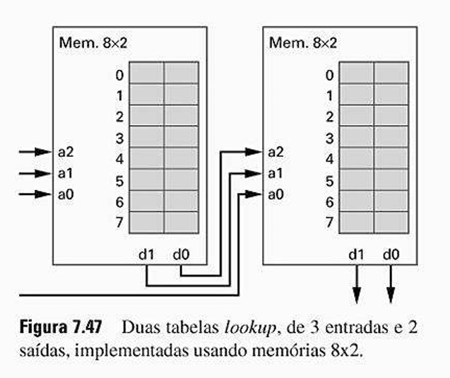
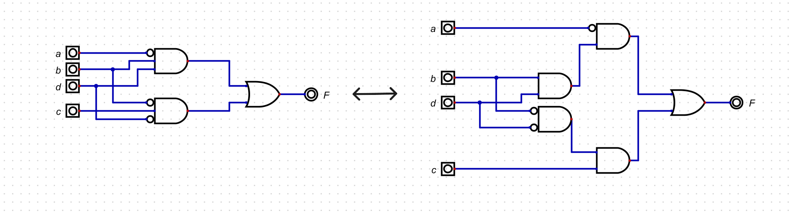
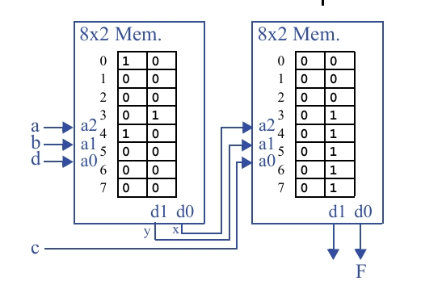

## Questão 7.22

Mostre como implementar em duas tabelas lookup, de três entradas e duas saídas, a seguinte função:  
**F(a, b, c, d) = a’bd + b’cd’**. Assuma que as duas tabelas lookup estão conectadas do modo mostrado na Fig.7.47. É possível que você não precise usar todas as saídas das tabelas lookup. 

---

**LUT1 (Esquerda):** Recebe 3 entradas externas (que chamaremos de in1, in2, in3) e produz 2 saídas intermediárias (d1, d0).

**LUT2 (Direita):** Recebe as 2 saídas da LUT1 (d1, d0) e mais 1 entrada externa (in4) para produzir as saídas finais.

---

### Objetivo
Implementar a função **F(a, b, c, d) = a’bd + b’cd’** usando a arquitetura de duas LUTs de 3 entradas.

---

## Variáveis de Entrada

4 variáveis (**a, b, c, d**). A forma mais natural de usar a arquitetura é:

- Conectar **a, b, c** às 3 entradas da **LUT1**.  
- Conectar **d** à entrada externa da **LUT2**.

---

## Decomposição da Função

Primeiro, decompõe a função em partes que podem ser gerenciadas pelas LUTs, definindo duas funções intermediárias, **x** e **y**, para serem calculadas pela primeira LUT.

- **x = a'bd**  
- **y = b'd'**

A segunda LUT usará **x**, **y** e a entrada restante **c** para calcular a função final, que se torna:

**F = x + cy**

---

A representação com portas lógicas para essa decomposição seria:

Como tem uma função de 4 variáveis (a, b, c, d) e se quer usar componentes de 3 entradas (as LUTs), precisa "quebrar" a função em partes menores.

**Circuito da Direita (com tracejado):** Este é o mais importante. Ele mostra a função F decomposta:

- **Função Intermediária x:** A porta E (AND) de cima calcula **x = a'bd**. Ela recebe **a** invertido, **b** direto e **d** direto.  
- **Função Intermediária y:** A porta E (AND) de baixo calcula **y = b'cd'**. Ela recebe **b** invertido, **c** direto e **d** invertido.  
- **Função Final F:** A porta OU (OR) final junta os resultados: **F = x + y**.

Esta decomposição nos diz que podemos resolver o problema se a primeira LUT calcular **x** e **y** e a segunda LUT somar (+) os resultados.

---

## Circuito

As tabelas-verdade são a "tradução" do diagrama de circuito para um formato de dados que a memória (LUT) pode entender. Elas são a "receita" de programação para as LUTs.

---

## Primeira Tabela-Verdade (Para a LUT da Esquerda)

Como ela funciona? Esta tabela calcula os valores das funções intermediárias **x** e **y** para cada combinação possível das entradas **a, b, d**.

| Endereço | Entradas (abc) | a b d | y = b’d’ | x = a’bd |
|---------:|----------------|-------|----------|----------|
| 0 | 000 | | 1 | 0 |
| 1 | 001 | | 0 | 0 |
| 2 | 010 | | 0 | 0 |
| 3 | 011 | | 0 | 1 |
| 4 | 100 | | 1 | 0 |
| 5 | 101 | | 0 | 0 |
| 6 | 110 | | 0 | 0 |
| 7 | 111 | | 0 | 0 |

---

## Segunda Tabela-Verdade (Para a LUT da Direita)

Como ela funciona? Esta tabela define a lógica final. Ela calcula **F** para cada combinação possível de **x, y** e **c**.  
A lógica implementada aqui é **F = x + cy**.  
A saída **d1** não é utilizada e pode ser 0.

| Endereço | Entradas (yxc) | y x c | F = x + cy | (d1, d0) |
|---------:|----------------|-------|------------|----------|
| 0 | 000 | | 0 | 00 |
| 1 | 001 | | 0 | 00 |
| 2 | 010 | | 1 | 01 |
| 3 | 011 | | 1 | 01 |
| 4 | 100 | | 0 | 00 |
| 5 | 101 | | 1 | 01 |
| 6 | 110 | | 1 | 01 |
| 7 | 111 | | 1 | 01 |

---

## Representação das LUTs

**LUT da Direita:** recebe os resultados da primeira (**y** e **x**) e a entrada restante **c** para gerar a saída final **F**.

**LUT da Esquerda:** recebe as entradas principais **a, b** e **d** para gerar os sinais intermediários **y** e **x**.
