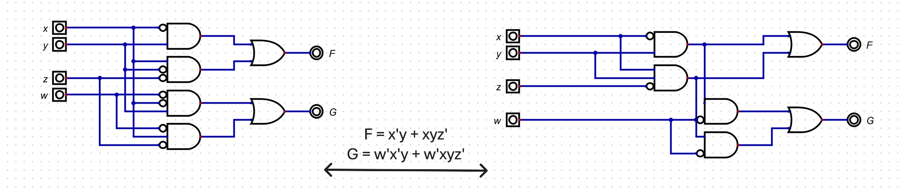
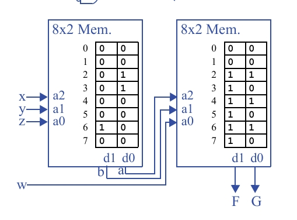

## Questão 7.23

Mostre como implementar em duas tabelas lookup, de três entradas e duas saídas, as seguintes funções:  
**F(x, y, z) = x’y + xyz’** e **G(w, x, y, z) = w’x’y + w’xyz’**. Assuma que as duas tabelas estão conectadas do modo mostrado na Fig. 7.47.

---

**LUT1 (Esquerda):** Recebe 3 entradas externas (que chamaremos de in1, in2, in3) e produz 2 saídas intermediárias (d1, d0).

**LUT2 (Direita):** Recebe as 2 saídas da LUT1 (d1, d0) e mais 1 entrada externa (in4) para produzir as saídas finais.

---

## Objetivo

Implementar simultaneamente as funções:

- **F(x, y, z) = x’y + xyz’**  
- **G(w, x, y, z) = w’x’y + w’xyz’**

---

## Decomposição das Funções

O segredo aqui é encontrar partes em comum entre as funções **F** e **G** para otimizar o circuito.

**Observação-chave:** a função **F** está contida dentro da função **G**:
  G = w’x’y + w’xyz’ = w'(x’y + xyz’)

Ou seja, **G = w' · F**

---

## Funções Intermediárias (Calculadas na LUT1)

A função **F** é uma soma de dois termos, chamando cada termo de **a** e **b**:

- **a = x'y**  
- **b = xyz'**

---

## Funções Finais (Calculadas na LUT2)

- A função final **F** é simplesmente a soma de **a** e **b**:  
  **F = a + b**

- A função final **G** é o resultado de **F (a+b)** passando por uma porta E com **w** invertido:  
  **G = w'(a+b)**

---

A representação com portas lógicas para essa decomposição

---

As tabelas traduzem essa lógica decomposta em dados para programar as LUTs.

---

## Primeira Tabela-Verdade (Para programar a LUT1)

Esta tabela calcula as saídas intermediárias **a** e **b** usando as entradas **x, y, z**.

| Entradas | Saídas Intermediárias |
|----------|----------------------|
| x y z    | b |
| 000      | 0 |
| 001      | 0 |
| 010      | 0 |
| 011      | 0 |
| 100      | 0 |
| 101      | 0 |
| 110      | 1 |
| 111      | 0 |

**Análise:** A coluna **a (x'y)** está correta (é 1 para as linhas 010 e 011).  
A coluna **b (xyz')** está correta (é 1 apenas para a linha 110).

---

## Segunda Tabela-Verdade (Para programar a LUT2)

Esta tabela usa os resultados **a** e **b** da LUT1, mais a entrada **w**, para calcular as saídas finais **F** e **G**.

| Entradas | Saídas Intermediárias |
|----------|----------------------|
| a b w    | F |
| 000      | 0 |
| 001      | 0 |
| 010      | 1 |
| 011      | 1 |
| 100      | 1 |
| 101      | 1 |
| 110      | 1 |
| 111      | 1 |

**Análise:** A coluna **F (a+b)** e a coluna **G (w'(a+b))** estão calculadas corretamente para todas as combinações de entrada.

---

## Implementação Final com LUTs

As tabelas-verdade são gravadas diretamente na memória das LUTs para criar o circuito final.

---

### LUT da Esquerda (LUT1)

- **Entradas de Endereço:** x, y, z  
- **Conteúdo da Memória:** Os dados da primeira tabela-verdade são gravados nas saídas **d1 (para b)** e **d0 (para a)**.

---

### LUT da Direita (LUT2)

- **Entradas de Endereço:** b (de d1), a (de d0) e w  
- **Conteúdo da Memória:** Os dados da segunda tabela-verdade são gravados nas saídas **d1 (para F)** e **d0 (para G)**.
