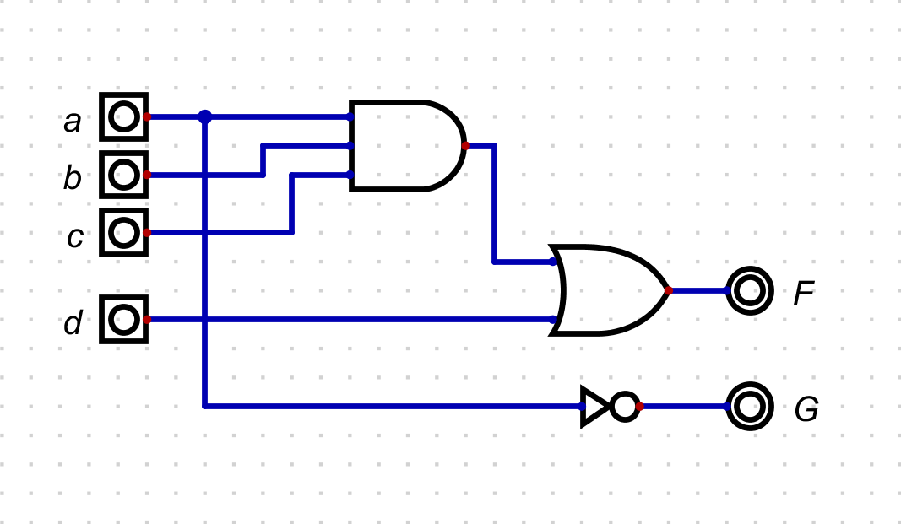
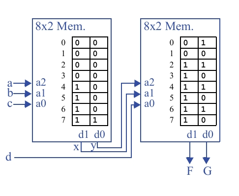

## Questão 7.24

Mostre como implementar em duas tabelas lookup, de três entradas e duas saídas, as seguintes funções:  
**F(a, b, c, d) = abc + d** e **G = a’**. Você deve implementar **F** e **G** com apenas duas tabelas lookup conectadas do modo mostrado na Fig. 7.47.

---

**LUT1 (Esquerda):** Recebe 3 entradas externas (que chamaremos de in1, in2, in3) e produz 2 saídas intermediárias (d1, d0).

**LUT2 (Direita):** Recebe as 2 saídas da LUT1 (d1, d0) e mais 1 entrada externa (in4) para produzir as saídas finais.

---

## Objetivo

Implementar simultaneamente as funções:

- **F(a, b, c, d) = abc + d**
- **G = a’**

usando a arquitetura de duas LUTs de 3 entradas.

---

## Decomposição da Função

A LUT1 irá pré-calcular os termos que a LUT2 precisará.

### Funções Intermediárias (Calculadas na LUT1):

- Para calcular **F**, a LUT2 precisará do termo **abc**. Então, definimos a primeira saída da LUT1 como **x = abc**.
- Para calcular **G**, a LUT2 precisará do termo **a'**. Então, definimos a segunda saída da LUT1 como **y = a'**.

### Funções Finais (Calculadas na LUT2):

- A LUT2 recebe **x**, **y** e **d** e calcula as saídas finais:  
  **F = x + d**  
  **G = y** (A LUT2 simplesmente "passa" o valor de **y** para a saída).

---

A representação com portas lógicas para essa decomposição é:

---

## Tabelas-Verdade Corretas

Com a decomposição definida, cria-se as tabelas-verdade que serão usadas para programar as LUTs.

| Endereço | Saí. Intermediárias | Entradas | Saídas finais |
|---------|--------------------|----------|---------------|
| a b c | x | y | x y d |
| 000 | 0 | 1 | 000 |
| 001 | 0 | 1 | 001 |
| 010 | 0 | 1 | 010 |
| 011 | 0 | 1 | 011 |
| 100 | 0 | 0 | 100 |
| 101 | 0 | 0 | 101 |
| 110 | 0 | 0 | 110 |
| 111 | 1 | 0 | 111 |

---

## Implementação Final com LUTs Corretas

Finalmente, usando as tabelas-verdade corretas para programar o conteúdo das memórias das LUTs.

---

## Análise da Implementação Correta

**LUT da Esquerda:**  
As entradas **a, b, c** formam o endereço. A coluna **d1** é programada com os valores de **x = abc**, e a coluna **d0** com os valores de **y = a'**.  
Por exemplo, para o endereço 7 (binário 111), a LUT retorna **10 (x=1, y=0)**.

**LUT da Direita:**  
As entradas são **x** (vindo de d1), **y** (vindo de d0) e **d**.  
A coluna de saída **d1** é programada com os valores de **F = x + d**, e a coluna **d0** com os valores de **G = y**.  
Por exemplo, para o endereço 3 (binário xyd = 011), a LUT retorna **11 (F=1, G=1)**.
