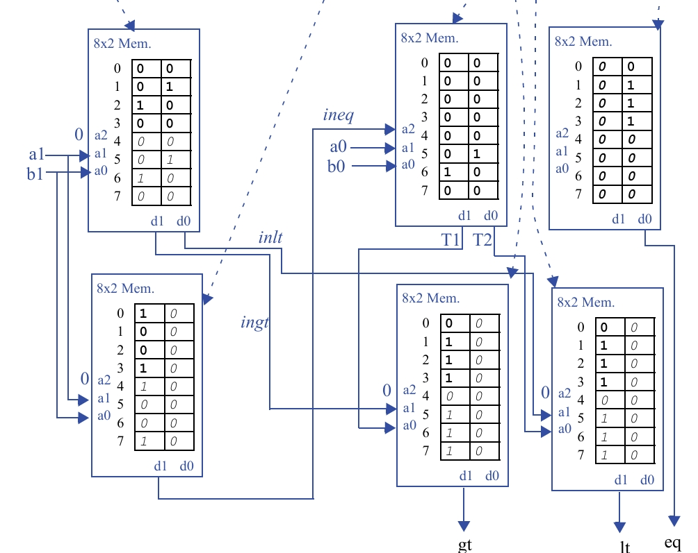

## Questão 7.25

Implemente um comparador de dois bits, que compara dois números de dois bits, e tem três saídas, indicando **“maior do que”**, **“menor do que”** e **“igual a”**. Podem ser usados um número qualquer de tabelas lookup, de três entradas e duas saídas, e conexões customizadas entre as tabelas lookup.

---

## O Conceito Central: Comparação em Cascata ("Ripple-Carry")

A ideia principal é imitar a forma como fazemos a comparação manualmente: olhamos primeiro os dígitos mais significativos e, somente se eles forem iguais, olhando para os próximos.  

O circuito na imagem faz o oposto: ele começa a comparação pelos bits menos significativos (LSB), **a0** e **b0**, e "propaga" (ripples) o resultado dessa comparação para o estágio seguinte, que então compara os bits mais significativos (MSB), **a1** e **b1**, para tomar a decisão final.  

A solução é construída a partir de um bloco lógico que pode-se chamar de **"somador completo de 1 bit"**.

---

## Etapa 1: As Equações Lógicas (Topo à Direita)

Esta parte define a lógica de cada estágio da cascata. Imagine um bloco que compara **a** e **b**, mas que também recebe os resultados (**in_gt**, **in_lt**, **in_eq**) da comparação do estágio anterior.

- eq = in_eq * (a xnor b)

**Tradução:** A saída "igual" (**eq**) só será 1 se o estágio anterior já era "igual" (**in_eq = 1**) **E** os bits atuais **a** e **b** também forem iguais.

- gt = in_gt + (in_eq * a * b')

**Tradução:** A saída "maior que" (**gt**) será 1 se o estágio anterior já era "maior que" (**in_gt = 1**), **OU** se o estágio anterior era "igual" (**in_eq = 1**) **E** o bit **a** atual for maior que o bit **b** (**a = 1**, **b = 0**).

- lt = in_lt + (in_eq * a' * b)

**Tradução:** A saída "menor que" (**lt**) será 1 se o estágio anterior já era "menor que" (**in_lt = 1**), **OU** se o estágio anterior era "igual" (**in_eq = 1**) **E** o bit **a** atual for menor que o bit **b** (**a = 0**, **b = 1**).

---

## Etapa 2: A Implementação com LUTs

A imagem mostra como essa lógica em cascata é implementada usando as LUTs. Ela é dividida em duas camadas ou estágios.

---

### Camada 1: Comparando os Bits Menos Significativos (LSB)

O primeiro circuito compara **a0** e **b0**. Como não há um estágio anterior, as entradas "in" (**in_gt**, **in_lt**, **in_eq**) são assumidas como **0**, **0** e **1** respectivamente (a condição inicial é "igualdade").

#### LUTs do Meio (Entradas a0, b0):

- **LUT de cima (saída ineq):**  
  Esta LUT calcula se **a0** é igual a **b0**. A saída **ineq** (inequality, ou igualdade vinda de dentro) é 1 somente quando **a0 = b0**. A tabela-verdade e o conteúdo da memória estão corretos para **a0 xnor b0**.

- **LUT de baixo (saídas ingt, inlt):**  
  Esta LUT calcula se **a0 > b0** ou **a0 < b0**.  
  A saída **ingt** (greater-than vindo de dentro) é **a0 b0'**.  
  A saída **inlt** (less-than vindo de dentro) é **a0' b0**.  
  O conteúdo da memória está correto para essas duas funções.

Neste ponto, temos três sinais (**ineq**, **ingt**, **inlt**) que resumem completamente a comparação entre **a0** e **b0**.

---

### Camada 2: Comparando os Bits Mais Significativos (MSB) e Decisão Final

A imagem mostra como essa lógica em cascata é implementada usando as LUTs. Ela é dividida em duas camadas ou estágios.

Agora, a camada final de LUTs usa os bits **a1** e **b1**, mais os resultados da camada anterior, para produzir as saídas finais **gt**, **lt** e **eq**.

#### LUTs da Direita (Entradas a1, b1, e os sinais ineq, ingt, inlt):

Estas três LUTs implementam as equações lógicas da **Etapa 1**.

- **LUT para eq (saída final):**  
  Recebe **a1**, **b1** e **ineq**. Ela calcula a função  
  `eq = ineq * (a1 xnor b1)`.

- **LUT para gt (saída final):**  
  Recebe **a1**, **b1**, **ineq** e **ingt**. Ela implementa a função  
  `gt = ingt + (ineq * a1 * b1')`.

- **LUT para lt (saída final):**  
  Recebe **a1**, **b1**, **ineq** e **inlt**. Ela implementa a função  
  `lt = inlt + (ineq * a1' * b1)`.

*(Nota: Como as LUTs só têm 3 entradas, a implementação real das funções de 4 entradas **gt** e **lt** exigiria uma decomposição adicional, mas a imagem simplifica isso para mostrar a intenção lógica).*

---

## Resumo do Fluxo

- A primeira camada de LUTs compara os bits menos importantes (**a0**, **b0**) e gera os sinais de status **ingt**, **inlt**, **ineq**.
- A segunda camada de LUTs recebe esses sinais de status e os usa como "contexto" para comparar os bits mais importantes (**a1**, **b1**).
- Ela então combina o resultado da comparação de **a1** e **b1** com o contexto vindo dos bits anteriores para gerar a resposta final e definitiva.

Essa é uma solução muito eficiente em termos de hardware, embora a lógica para entendê-la seja mais complexa do que a abordagem modular.
